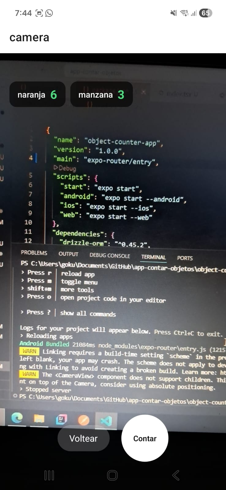

# 📱 Object Counter App

Aplicación móvil para el conteo masivo de objetos en tiempo real utilizando visión por computadora.

---

## 🚀 Estado del proyecto

### ✅ Sprint 0 — Configuración inicial

- ✔ Proyecto Expo creado
- ✔ Estructura de carpetas definida
- ✔ Configuración de Expo Router
- ✔ Base de datos SQLite configurada (Drizzle ORM)
- ✔ Navegación base funcionando

---

### ✅ Sprint 1 — Cámara + Mock de detección

- ✔ Cámara funcional en dispositivo real
- ✔ Permisos correctamente gestionados
- ✔ Pantalla `/camera` implementada
- ✔ Hook `useDetection` creado (simulación de detección)
- ✔ Botones funcionales:
  - Contar
  - Detener
  - Voltear cámara
- ✔ Overlay con conteo dinámico (datos simulados)

---

## 📸 Evidencia

<p align="center">
  
</p>

---

## 🧠 Nota importante

Actualmente el conteo es simulado (mock):

```ts
const mockClases = ['naranja', 'manzana', 'botella'];