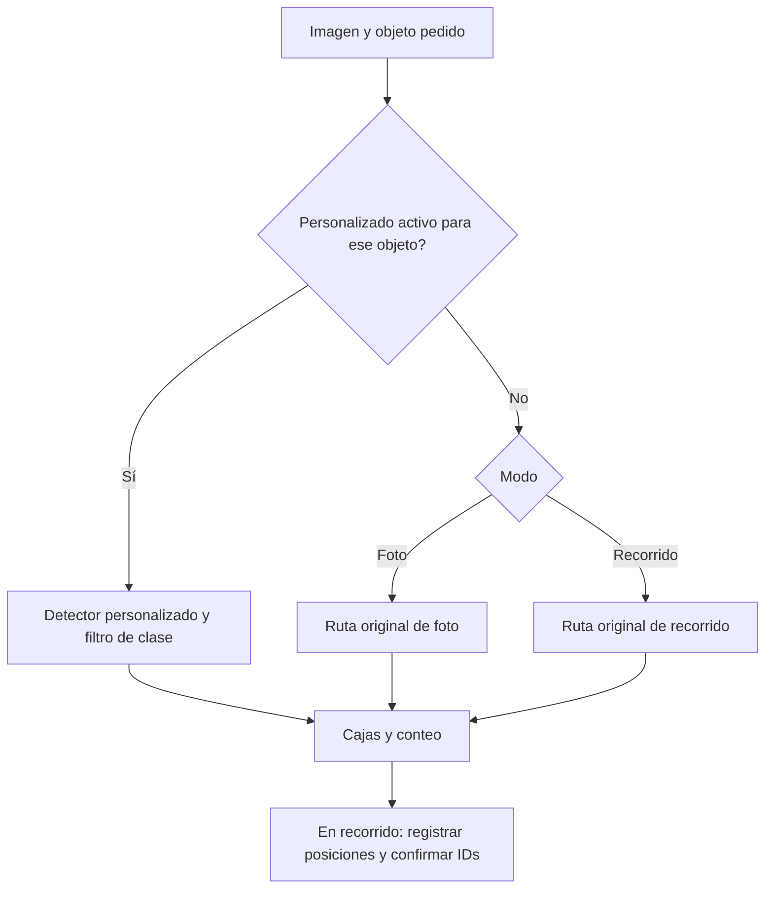

# Cómo se elige el detector

La inferencia no busca imágenes en un dataset. Cada modelo aplica los pesos que ya aprendió a la imagen recibida. Los datasets se utilizan durante entrenamiento y evaluación, no como una base de datos consultada en cada conteo.

## Modelo personalizado habilitado

El backend elige la ruta antes de contar. Con el perfil de aula, los objetivos compatibles con el checkpoint van directamente al modelo personalizado (monitor/mouse y, en versiones ampliadas, teclado), filtrando la clase solicitada. Con el perfil de monitores, solo monitor va a monitores v3. No se prueba primero el modelo general ni se consulta automáticamente YOLO-World cuando el personalizado omite algo. En el perfil aula actual, mouse combina aula-mouse-v4 y aula-keyboard-v6: conserva las cajas del primero y añade del segundo las que no coinciden espacialmente (IoU >=0,35 o contención >=0,8 significa duplicado). Es una combinación fija para esa categoría, no una búsqueda por ensayo entre modelos. Monitor conserva v4 para evitar la regresión encontrada en los cuadros del video; teclado usa v6. Cada uno requiere una sola inferencia. Las categorías restantes conservan las rutas originales.



## Foto: ruta original

`backend/services/static_counter.py` calcula primero propuestas por semejanza visual si el usuario seleccionó un ejemplar. Cuando encuentra al menos dos formas semejantes y una corresponde al ejemplar, puede usar solo esa apariencia, sin ejecutar los modelos semánticos.

En los otros casos divide la foto en mosaicos y, para cada uno, ejecuta primero YOLOv8n general y después YOLO-World dirigido por el texto. Ambas salidas se combinan: World no se ejecuta únicamente cuando el primero falla. Con una selección, filtra las categorías del general que detectaron el ejemplar y exige que World también localice esa referencia antes de aportar sus cajas. Finalmente fusiona propuestas para reducir duplicados. Esta ruta heredada puede confundir apariencia con categoría; no equivale al detector personalizado.

## Recorrido: ruta original

Para categorías de equipo conocidas (mouse, teclado, monitor/TV y portátil), `/detect` usa YOLOv8n filtrado por el ID COCO correspondiente. Para otras búsquedas puede usar las propuestas de apariencia aceptadas por el seguimiento o YOLO-World con los nombres configurados. No ejecuta siempre ambos modelos en cada cuadro.

Cuando quedan pocos puntos de fondo, el registro reintenta SIFT con menor umbral de contraste y limita a 1600 descriptores después de enmascarar objetos. Mantiene el mínimo de 40 puntos, 18 coincidencias y los controles geométricos; no usa textura de los objetos como sustituto.

El detector devuelve dónde ve objetos. `SurfaceScan` intenta alinear el fondo, asociar posiciones y confirmar IDs para evitar repetir el conteo. Si no encuentra suficientes detalles del fondo, puede ver un objeto pero no añadirlo al total acumulado. Entrenar el detector no resuelve automáticamente ese problema.

## Identificar la referencia

`/identify` con un rectángulo explícito guarda la referencia y el nombre original pedido, sin necesitar que un modelo la reconozca primero. Sin rectángulo intenta identificar con YOLO-World. Esta etapa no debe confundirse con el detector usado después para contar.

## Qué hacen los arrays

Ejemplo real: `['computer mouse', 'mouse']`.

- Para YOLO-World son las descripciones candidatas enviadas a `set_classes`. Pueden cambiar qué busca y sus resultados; no entrenan pesos nuevos.
- Los alias españoles como `mouse`, `mouses`, `ratón` o `ratones` sirven para normalizar la petición. En el detector COCO la categoría mouse tiene ID 64.
- `CATEGORIAS_FOTO_DIRECTA` proporciona vocabulario a World cuando no hay objetivo escrito en la ruta original de foto.
- En la ruta personalizada la petición se convierte en la clase entrenada (monitor=0, mouse=1 y teclado/keyboard=2 en el dataset ampliado). Cambiar las palabras destinadas a World no cambia los pesos ni la capacidad de ese detector personalizado.

Es posible cambiar un array y no observar diferencias: quizá esa petición no usó World, ambos nombres eran equivalentes para la imagen, o el problema era tamaño/oclusión/calidad. Agregar una palabra no garantiza que reconozca una categoría nueva.

El nombre `aula` selecciona un perfil del servidor. **No es el nombre que debes escribir para contar**: escribe `monitor`, `mouse` o `teclado`. El filtro se elige antes de ejecutar la inferencia; no se prueban modelos sucesivamente hasta obtener una respuesta.

## Dataset: una imagen puede contener varias categorías

Las carpetas originales `monitor/`, `mouse/` y `teclado/` organizan los aportes. El dataset exportado organiza imágenes y etiquetas por uso:

```text
dataset/
  images/train/mesa.jpg
  labels/train/mesa.txt
  images/val/otra-mesa.jpg
  labels/val/otra-mesa.txt
dataset.yaml
```

Cada línea de `mesa.txt` describe un objeto: ID de clase, centro X/Y y ancho/alto normalizados. Puede haber diez líneas mouse y dos monitor en la misma foto. `dataset.yaml` fija qué significa cada ID. `annotations.json` conserva las cajas legibles en píxeles, procedencia y división. No se crea una clase nueva por cada monitor físico ni se repite `monitor` como categoría al incorporar otra foto.

El entrenamiento produce pesos `.pt`; contar usa esos pesos. Para ejecutar en otra máquina basta distribuir pesos, código, configuración y dependencias. Para repetir exactamente el entrenamiento también hacen falta las imágenes y etiquetas de esa versión.

## Git y main

El merge de esta rama llevará a main lo versionado: código, configuración, documentación y los checkpoints distribuidos bajo `backend/models/`. No transporta archivos ignorados ni el historial SQLite de un teléfono. Las fotos privadas y ejecuciones intermedias permanecen fuera de Git. La guía de instalación permite usar los pesos incluidos sin necesitar esa carpeta privada.

Hasta que la rama se publique, los cambios solo existen localmente; hasta que se integre, clonar main no incluye esta rama. El estado de publicación debe comprobarse en Git, no inferirse de la existencia de archivos locales.
